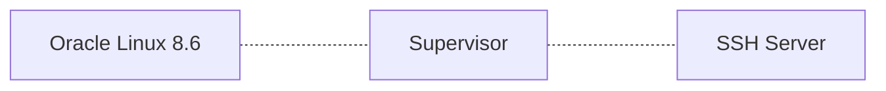

# SSH Server Docker

The docker image with SSHD service is suitable to host shared directories for other docker containers.

Consists of following components:



## 1. Build and Tag Image

On Linux:
```sh
./build.sh
```
On Windows:
```bat
build.bat
```
Or via Docker CLI:
```sh
docker build --tag cameek/sshd:0.3 .
```

## 2. Run Linux Desktop Image 

On Linux modify and execute:
```sh
./run.sh
```
On Windows modify and execute
```bat
run.bat
```
Or via Docker CLI:
```sh
docker run -it \
 --volumes-from shared-apps \
 --volumes-from shared-data \
 -p 8005:11 -p 22005:22 -p 59005:5901 \
 --name box-5 \
 --hostname box-5 \
 cameek/linux-desktop-base:0.3
```


## 4. Known Issues

### Blurred Text

When using scale on your host system, typically 125% or 150%, the VNC session text looks blurred.

At least in browser there is a workaround - you can zoom out the page with NoVNC session:

* for 125% scaling on host desktop -> set browser zoom to 80% + set in the container display DPI from 96 to 128

* for 150% scaling on host desktop -> set browser zoom to 75% + set in the container display DPI from 96 to 128

  

## 5. References

https://github.com/kasmtech/workspaces-core-images

https://github.com/kasmtech/workspaces-images

https://www.digitalocean.com/community/tutorials/how-to-remotely-access-gui-applications-using-docker-and-caddy-on-debian-9

https://github.com/novnc/noVNC.git

https://hub.docker.com/r/linuxserver/rdesktop
